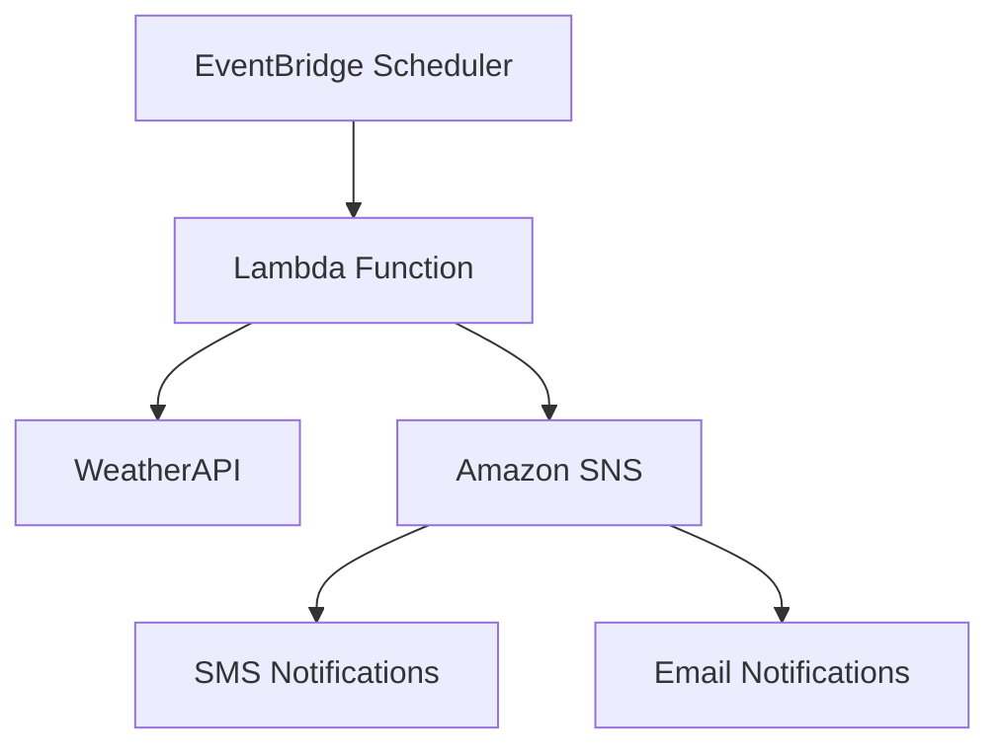

# 🌦️ Weather Forecast SMS Bot

Un sistema automatizado de alertas meteorológicas que evolucionó desde un bot básico hasta una arquitectura serverless completa en AWS, enviando notificaciones SMS cuando se detecta probabilidad de lluvia en Málaga, España.

## 📋 Descripción del Proyecto

Este proyecto representa la evolución de un sistema de alertas meteorológicas, comenzando como una aplicación Python simple ejecutándose en EC2 y evolucionando hacia una arquitectura moderna y escalable basada en servicios serverless de AWS.

### Evolución del Proyecto

**Versión 1.0 - Bot Tradicional (EC2)**
- Bot automatizado ejecutándose en instancia EC2
- Consulta directa a APIs de clima
- Envío de SMS mediante Twilio
- Programación mediante cron jobs

**Versión 2.0 - Arquitectura Serverless (AWS)**
- Función Lambda para procesamiento
- EventBridge para programación automática
- SNS para notificaciones distribuidas
- Arquitectura sin servidor, escalable y eficiente

## 🏗️ Arquitectura Actual (Serverless)

### Componentes Principales



### Flujo de Funcionamiento

1. **EventBridge Scheduler** - Ejecuta la función Lambda automáticamente cada mañana
2. **Lambda Function** - Procesa los datos meteorológicos y filtra alertas de lluvia
3. **WeatherAPI** - Proporciona datos meteorológicos actualizados
4. **Amazon SNS** - Distribuye notificaciones a múltiples canales
5. **Notificaciones** - Envía alertas por SMS y/o email

## 🛠️ Tecnologías Utilizadas

### Versión Original (EC2)
- **AWS EC2** - Instancia en la nube para ejecución continua
- **Twilio API** - Plataforma de comunicaciones para SMS
- **WeatherAPI** - Servicio de datos meteorológicos
- **Python 3.11** - Lenguaje de programación principal
- **pipenv** - Gestión de dependencias y entornos virtuales
- **pandas** - Procesamiento y análisis de datos meteorológicos
- **requests** - Comunicación con APIs externas
- **Ubuntu** - Sistema operativo de la instancia

### Versión Actual (Serverless)
- **AWS Lambda** - Función serverless para procesamiento de datos
- **Amazon EventBridge** - Programación automática de ejecuciones  
- **Amazon SNS** - Sistema de notificaciones distribuidas (reemplaza Twilio)
- **WeatherAPI** - Servicio de datos meteorológicos (mantenido)
- **Python 3.11** - Runtime de Lambda
- **boto3** - SDK de AWS para Python
- **pandas** - Procesamiento de datos meteorológicos
- **requests** - Comunicación con APIs externas

## ⚡ Funcionamiento Actual

### Proceso Automatizado

1. **Programación**: EventBridge ejecuta la función Lambda diariamente a las 7:00 AM
2. **Obtención de Datos**: La función consulta WeatherAPI para el pronóstico horario de Málaga
3. **Procesamiento**: Analiza los datos y filtra horas con probabilidad de lluvia (7 AM - 10 PM)
4. **Notificación**: Si detecta lluvia, publica el mensaje en SNS
5. **Distribución**: SNS envía las notificaciones a todos los suscriptores configurados

### Ventajas de la Arquitectura Serverless

- **Escalabilidad Automática**: Se adapta automáticamente a la demanda
- **Costo Optimizado**: Solo paga por el tiempo de ejecución
- **Alta Disponibilidad**: Resistente a fallos con redundancia automática
- **Mantenimiento Mínimo**: No requiere gestión de servidores
- **Flexibilidad**: Fácil adición de nuevos canales de notificación

## 📊 Características

### Funcionalidades Core
- **Filtrado Inteligente**: Solo notifica cuando hay probabilidad real de lluvia durante el día
- **Información Precisa**: Muestra horas específicas y condiciones meteorológicas detalladas
- **Ejecución Programada**: Funciona automáticamente sin intervención manual
- **Enfoque Geolocalizado**: Configurado específicamente para Málaga, Andalucía

### Mejoras en la Versión Serverless
- **Múltiples Canales**: Soporte para SMS, email y otros sistemas de notificación
- **Escalabilidad**: Puede manejar miles de suscriptores sin degradación
- **Monitoreo**: Integración con CloudWatch para logs y métricas
- **Resiliencia**: Tolerancia a fallos automática

## 🌐 Infraestructura

### Arquitectura Original
- **AWS EC2**: Instancia t2.micro ejecutando Ubuntu
- **Cron Jobs**: Programación de tareas del sistema
- **Twilio**: API externa para envío de SMS

### Arquitectura Actual
- **AWS Lambda**: Función serverless con runtime Python 3.11
- **Amazon EventBridge**: Reglas de programación con expresiones cron
- **Amazon SNS**: Temas de notificación con suscriptores múltiples
- **AWS CloudWatch**: Monitoreo y logging automático
- **AWS IAM**: Gestión de permisos y seguridad

## 📁 Estructura del Proyecto

```
weather-forecast/
├── mensajes_twilio.py              # Script principal del bot original (EC2)
├── mensajes_twilio.ipynb          # Notebook de desarrollo y pruebas
├── lamda_function.py              # Función Lambda (versión serverless)
├── twilio_config_template.py      # Template de configuración de APIs
├── Pipfile                        # Dependencias del proyecto
├── Pipfile.lock                   # Versiones exactas de dependencias
├── .gitignore                     # Archivos excluidos del control de versiones
└── README.md                      # Este archivo
```

## 🚀 Despliegue

### Configuración de la Función Lambda

```python
# Configuración de variables de entorno en Lambda
API_KEY_WAPI = "tu_api_key_weatherapi"
SNS_TOPIC_ARN = "arn:aws:sns:region:account:weather-alerts"
```

### Configuración de EventBridge

```json
{
  "ScheduleExpression": "cron(0 7 * * ? *)",
  "Description": "Ejecutar alerta meteorológica diariamente a las 7 AM",
  "State": "ENABLED"
}
```

### Configuración de SNS

1. **Crear Tema SNS**: `weather-alerts-malaga`
2. **Configurar Suscriptores**: 
   - SMS: Números de teléfono
   - Email: Direcciones de correo
   - Otros: Webhooks, SQS, etc.

## 📈 Beneficios de la Migración

| Aspecto | EC2 Original | Serverless Actual |
|---------|-------------|-------------------|
| **Costos** | $8-15/mes constante | $0.20-2/mes según uso |
| **Escalabilidad** | Manual | Automática |
| **Mantenimiento** | Alto (OS, seguridad) | Mínimo |
| **Disponibilidad** | 99.9% | 99.95%+ |
| **Tiempo de despliegue** | 15-30 minutos | 2-5 minutos |
| **Canales de notificación** | Solo SMS (Twilio) | SMS, Email, Webhooks |

## 🔧 Desarrollo Local

```bash
# Clonar el repositorio
git clone https://github.com/tu-usuario/weather-forecast

# Instalar dependencias
pipenv install

# Activar entorno virtual
pipenv shell

# Configurar las APIs (crear archivo basado en template)
cp twilio_config_template.py twilio_config.py
# Editar twilio_config.py con tus credenciales

# Ejecutar versión original (EC2)
python mensajes_twilio.py
```

## 🔒 Seguridad y Mejores Prácticas

- **Variables de Entorno**: Todas las API keys se almacenan de forma segura
- **IAM Roles**: Permisos mínimos necesarios para cada servicio
- **Cifrado**: Datos en tránsito y en reposo protegidos
- **Monitoreo**: Alertas automáticas para fallos o comportamientos anómalos

## 🎯 Roadmap Futuro

- [ ] **Múltiples Ciudades**: Expandir a otras ubicaciones geográficas
- [ ] **Predicciones Avanzadas**: Integrar ML para mejorar precisión
- [ ] **Dashboard Web**: Interfaz de usuario para configuración
- [ ] **API Gateway**: Exponer API pública para terceros
- [ ] **Multi-idioma**: Soporte para notificaciones en varios idiomas

---